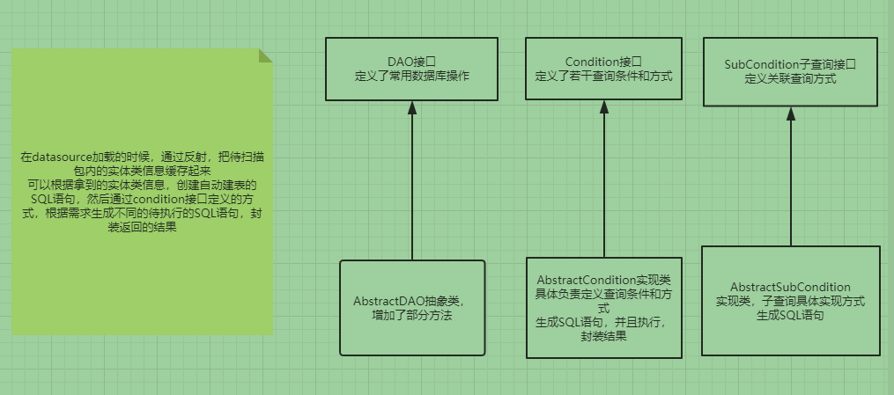

# sorm

#### 介绍
超级sorm实体类映射框架，简化操作数据库的相关操作，目前只支持MySQL和MariaDB

#### 软件架构
原生jdbc的封装
面向接口编程
DAO接口定义常见数据库操作（增，删，改，查）
AbstractDAO抽象类实现DAO接口
真正处理操作的是AbstractCondition类
这个类继承自Condition接口
操作数据库，无非就是组装查询条件，创建SQL语句，交给PreparedStatement对象去执行
拿到返回结果，封装到实体类中
 

#### 安装教程
如果是maven项目
导入maven依赖即可

如果不是maven项目的话
需要引入slf4j、logback-class、logback-core、fastjson依赖

#### 使用说明
SormFactory中的静态newInstance方法，返回SormFactory对象
通过SormFactory设置需要扫描的实体类包
加载datasource
最后返回DAO

#### 注意：
每一个实体类不能出现自定义的构造方法，否则不能返回关联查询的复杂对象信息和ID主键信息

#### 项目进度
- [x] 设计
- [x] 项目结构
- [x] mysql
- [x] MariaDB 
- [ ] 持续开发
